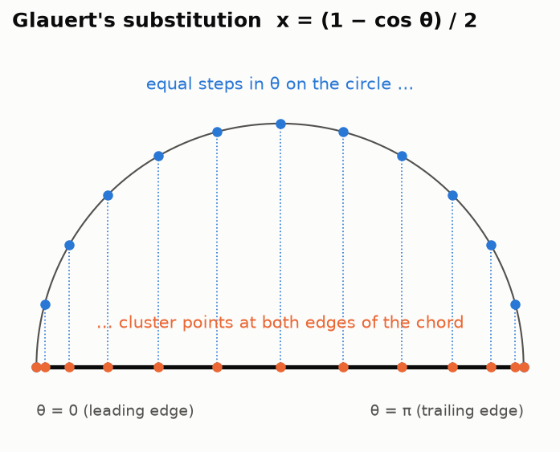
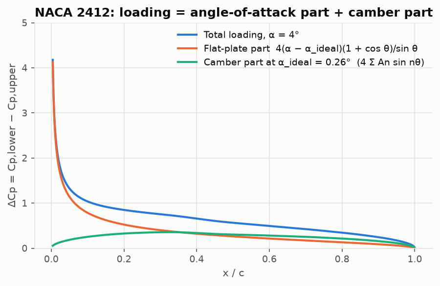
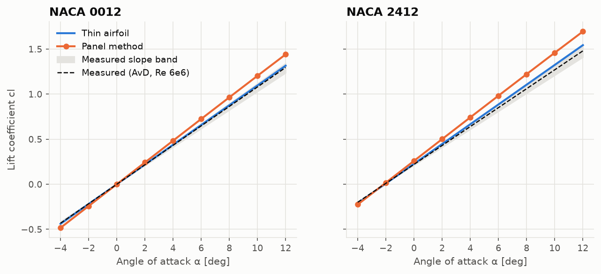

# Lesson 1 · Thin airfoil theory

> *"Where does lift come from, and how much do we get?"* In this lesson we answer that for
> an airfoil using nothing but a sheet of vortices and one clever change of variables.

**Code:** [`src/aero/thin_airfoil/theory.py`](../../src/aero/thin_airfoil/theory.py) ·
**Notebook:** [`01_thin_airfoil.ipynb`](../../notebooks/01_thin_airfoil.ipynb) ·
**Next:** [Lesson 2 — Panel method](02-panel-method.md)

## Learning objectives

By the end of this lesson you should be able to

1. explain why a vortex sheet is the natural model for a lifting airfoil;
2. write down the *fundamental equation of thin airfoil theory* and the Kutta condition;
3. solve it with Glauert's substitution and a Fourier series;
4. derive $c_l$, $\alpha_{L0}$, $c_{m,c/4}$ and the aerodynamic centre from three coefficients;
5. compute all of these for a NACA 4-digit section by hand and with the code.

---

## 1. The physical picture

Far from the airfoil the flow is uniform. Near it, the air speeds up over the upper surface
and slows down under the lower one. Bernoulli then tells us the pressure is lower on top: that
pressure difference *is* the lift.

A velocity jump across a thin surface is exactly what a **vortex sheet** produces. If the sheet
has strength $\gamma(x)$ (circulation per unit length), the tangential velocity just above and
just below it differ by

$$
u_{upper} - u_{lower} = \gamma(x).
$$

So the idea is simple: *replace the airfoil by a vortex sheet and choose $\gamma(x)$ so that the
flow behaves like flow around the airfoil*. Two assumptions make the problem tractable:

- **Thin:** thickness is ignored; only the mean camber line $z(x)$ matters.
- **Small angles:** $\alpha$ and the camber slope $dz/dx$ are small, so the sheet can sit on the
  chord line ($0 \le x \le c$) instead of on the curved camber line.

## 2. The fundamental equation

The camber line must be a **streamline**: the flow cannot cross it. The freestream contributes a
normal velocity $V_\infty(\alpha - dz/dx)$ to the camber line (small-angle version). The vortex
sheet must cancel it. A small piece $\gamma(\xi)\,d\xi$ at $\xi$ induces at $x$ a vertical
velocity $\gamma(\xi)\,d\xi / [2\pi(x - \xi)]$, like a point vortex. Adding all pieces:

$$
\boxed{\;\frac{1}{2\pi}\int_0^c \frac{\gamma(\xi)\,d\xi}{x - \xi} = V_\infty\left(\alpha - \frac{dz}{dx}\right)\;}
$$

This is an **integral equation**: the unknown $\gamma$ sits inside an integral. The integral is
singular at $\xi = x$ and is taken as a Cauchy principal value.

One equation is not enough. For any $\gamma$ that solves it, adding a pure circulation that
induces no normal velocity on the chord still solves it. We need one more physical condition,
the **Kutta condition**:

$$
\gamma(c) = 0 ,
$$

meaning the flow leaves the sharp trailing edge smoothly with equal speeds on both sides. The
Kutta condition is how viscosity, which is absent from the model, fixes the circulation and
therefore the lift.

## 3. Glauert's trick

The singular kernel and the square-root behaviour near the edges become easy after the
substitution

$$
x = \frac{c}{2}(1 - \cos\theta), \qquad 0 \le \theta \le \pi .
$$



Equal steps in $\theta$ pack points near the leading and trailing edges, which is exactly where
the solution changes fastest. You will see this spacing again: the panel method (Lesson 2) and
the vortex lattice method (Lesson 4) both use it.

The key integral that makes everything work is **Glauert's integral**:

$$
\int_0^\pi \frac{\cos n\theta_0}{\cos\theta_0 - \cos\theta}\,d\theta_0 = \pi\,\frac{\sin n\theta}{\sin\theta}.
$$

### 3.1 The flat plate first

For a flat plate ($dz/dx = 0$) try $\gamma(\theta) = 2\alpha V_\infty\,\frac{1+\cos\theta}{\sin\theta}$.
With the $n = 0$ and $n = 1$ cases of Glauert's integral, the left side of the fundamental
equation becomes exactly $V_\infty\alpha$. At $\theta = \pi$ (trailing edge), $1 + \cos\theta = 0$,
so the Kutta condition holds. At $\theta = 0$ (leading edge) $\gamma \to \infty$: the famous
**leading-edge singularity**, the thin-airfoil version of the suction peak.

### 3.2 Any camber line

For a cambered airfoil, add a Fourier sine series that vanishes at both edges:

$$
\gamma(\theta) = 2V_\infty\left[A_0\,\frac{1 + \cos\theta}{\sin\theta} + \sum_{n=1}^{\infty} A_n\sin n\theta\right].
$$

Substituting and using Glauert's integral term by term turns the fundamental equation into

$$
\frac{dz}{dx} = (\alpha - A_0) + \sum_{n=1}^\infty A_n\cos n\theta .
$$

That is a **Fourier cosine series of the camber slope**, so the coefficients follow from
orthogonality:

$$
A_0 = \alpha - \frac{1}{\pi}\int_0^\pi \frac{dz}{dx}\,d\theta_0,
\qquad
A_n = \frac{2}{\pi}\int_0^\pi \frac{dz}{dx}\cos n\theta_0\,d\theta_0 .
$$

Notice that **only $A_0$ depends on $\alpha$**. Every $A_{n\ge1}$ depends only on the shape of
the camber line.

## 4. From circulation to forces

The Kutta–Joukowski theorem gives lift per unit span as $L' = \rho_\infty V_\infty\Gamma$ with
$\Gamma = \int_0^c \gamma\,dx$. Integrating the series (only the $A_0$ and $A_1$ terms survive):

$$
\Gamma = c\,V_\infty\,\pi\left(A_0 + \tfrac{1}{2}A_1\right)
\quad\Longrightarrow\quad
c_l = \frac{L'}{\tfrac12\rho V_\infty^2 c} = \pi\,(2A_0 + A_1).
$$

Writing $A_0$ out:

$$
\boxed{\;c_l = 2\pi\,(\alpha - \alpha_{L0}),\qquad
\alpha_{L0} = -\frac{1}{\pi}\int_0^\pi \frac{dz}{dx}\,(\cos\theta_0 - 1)\,d\theta_0\;}
$$

Two classic results fall out:

1. **The lift slope is $2\pi$ per radian (≈ 0.110 per degree) for every thin airfoil.** Camber
   does not change the slope; it shifts the curve left by $\alpha_{L0}$.
2. **Positive camber gives a negative zero-lift angle**: a cambered section lifts at $\alpha = 0$.

The moment about the leading edge (nose-up positive) comes from weighting the loading by $x$:

$$
c_{m,LE} = -\left[\frac{c_l}{4} + \frac{\pi}{4}(A_1 - A_2)\right],
\qquad
c_{m,c/4} = c_{m,LE} + \frac{c_l}{4} = \frac{\pi}{4}(A_2 - A_1).
$$

$c_{m,c/4}$ contains no $\alpha$. **The quarter-chord point is the aerodynamic centre**: the
moment there does not change with incidence. That is why wings are located and structurally
referenced at their quarter chord.

The **centre of pressure**, where the resultant force acts, *does* move:

$$
\frac{x_{cp}}{c} = \frac14\left[1 + \frac{\pi}{c_l}(A_1 - A_2)\right],
$$

and it runs off to infinity as $c_l \to 0$ on a cambered section. This is why engineers prefer
the aerodynamic centre.

### The loading, split in two

The pressure difference is $\Delta C_p = 2\gamma/V_\infty$. At the **ideal angle of attack**
$\alpha_{ideal} = \frac1\pi\int_0^\pi \frac{dz}{dx}\,d\theta_0$ we get $A_0 = 0$ and the
leading-edge singularity disappears: the flow meets the leading edge smoothly. Any other angle
adds a flat-plate-shaped load on top:



The orange curve (angle of attack) carries the suction peak. The green curve (camber) is a
smooth hump that exists at every incidence.

## 5. Worked example: NACA 2412

The NACA 4-digit camber line, with max camber $m$ at chordwise station $p$ (here $m = 0.02$,
$p = 0.4$):

$$
\frac{dz}{dx} =
\begin{cases}
\dfrac{2m}{p^2}(p - x), & x \lt p\\[2mm]
\dfrac{2m}{(1-p)^2}(p - x), & x \ge p
\end{cases}
$$

The integrals can be done by hand (Anderson, Example 4.6) or numerically:

```python
from aero.thin_airfoil import ThinAirfoil
import numpy as np

ta = ThinAirfoil.from_naca4("2412")
alpha = np.radians(4)
print(np.degrees(ta.alpha_zero_lift))  # -2.077 deg
print(ta.A1, ta.A2)  # 0.0815, 0.0139
print(ta.cl(alpha))  # 0.666
print(ta.cm_quarter_chord)  # -0.0531
print(ta.x_cp(alpha))  # 0.330
```

Checking by hand:

| Step | Value |
|---|---|
| $A_1$, $A_2$ | 0.0815, 0.0139 |
| $\alpha_{L0}$ | −2.077° |
| $c_l$ at 4° | $2\pi \times (4 + 2.077)° \times \frac{\pi}{180} = 0.666$ |
| $c_{m,c/4}$ | $\frac{\pi}{4}(0.0139 - 0.0815) = -0.0531$ |
| $x_{cp}$ at 4° | $\frac14\left[1 + \frac{\pi}{0.666}(0.0676)\right] = 0.330\,c$ |
| $\alpha_{ideal}$ | 0.26° |

**Against the wind tunnel** (Abbott & von Doenhoff): measured $\alpha_{L0} \approx -2.1°$, very
close. Measured $c_{m,c/4} \approx -0.045$, about 15 % smaller in magnitude than theory. The
boundary layer thickens over the aft upper surface and effectively removes some camber, a
viscous effect the model cannot see.



## 6. From equations to code

The whole method is about 60 lines ([`theory.py`](../../src/aero/thin_airfoil/theory.py)). The
key choices:

- **Integrate in $\theta$, not $x$.** The integrands are smooth in $\theta$, and the leading-edge
  behaviour is handled automatically.
- **Tell the integrator where the kink is.** The NACA camber line has a jump in curvature at
  $x = p$, so `quad` receives $\theta_p = \arccos(1 - 2p)$ as a breakpoint. Without it adaptive
  quadrature wastes effort and can lose digits.
- **Keep $A_0$'s $\alpha$ out of the cache.** The code stores
  $B_0 = \frac1\pi\int dz/dx\,d\theta$ once and returns $A_0 = \alpha - B_0$ on demand.
- **Test with an exact case.** For the parabolic arc $z = 4h\,x(1-x)$, $dz/dx = 4h\cos\theta$:
  only $A_1 = 4h$ survives, so $\alpha_{L0} = -2h$ and $c_{m,c/4} = -\pi h$ exactly. The test
  suite checks this to round-off.

## 7. Common pitfalls

| Pitfall | Symptom | Fix |
|---|---|---|
| Degrees vs radians | $c_l$ off by a factor of 57.3 | radians internally, convert only at the edges |
| Integrating in $x$ near $x = 0$ | noisy $A_n$ | integrate in $\theta$ |
| Using the *centre of pressure* as a reference | moment "changes sign" with $\alpha$ | reference moments to c/4 |
| Expecting finite $\Delta C_p$ at the LE | infinite peak in plots | expected; it is the model's suction peak (clip the plot) |
| Trusting $c_m$ quantitatively | 15–20 % too nose-down | viscous de-cambering; see Lesson 3 |

## 8. Exercises

1. Show that for a flat plate $c_{m,LE} = -c_l/4$, and hence that the centre of pressure is at
   the quarter chord.
2. For the parabolic arc of max camber $h$, find $\alpha_{ideal}$. What does the loading look
   like at that angle?
3. Using the code, plot $\alpha_{L0}$ and $c_{m,c/4}$ for NACA $m4xx$ with $m = 0\ldots 6$. Why
   are both exactly linear in $m$?
4. Keep $m = 0.04$ and vary $p$ from 0.2 to 0.7. Which $p$ gives the most nose-down moment? Why
   do reflexed sections (negative camber near the trailing edge) reduce it?

<details>
<summary>Answers</summary>

1. With $A_{n\ge1} = 0$, $c_{m,LE} = -c_l/4$. Then $x_{cp} = -c_{m,LE}\,c/c_l = c/4$.
2. $\alpha_{ideal} = \frac1\pi\int_0^\pi 4h\cos\theta\,d\theta = 0$. At $\alpha = 0$ the loading is
   $\Delta C_p = 8h\sin\theta$, a smooth hump with no leading-edge peak.
3. $dz/dx$ is proportional to $m$, and every result is a linear integral of $dz/dx$.
4. Moving camber aft increases $A_1 - A_2$; the most nose-down moment is at the aft end of the
   range. Reflex makes $dz/dx$ positive near the TE, which lowers $A_1$ and reduces $|c_m|$. That
   is why tailless aircraft use reflexed sections.

</details>

## Key takeaways

- A thin airfoil is a vortex sheet; the Kutta condition fixes its circulation.
- Glauert's substitution turns the integral equation into a Fourier series of the camber slope.
- $c_l = 2\pi(\alpha - \alpha_{L0})$: the slope is universal, camber only shifts the curve.
- The quarter chord is the aerodynamic centre; $c_{m,c/4} = \frac\pi4(A_2 - A_1)$.
- The theory predicts $\alpha_{L0}$ well; it overestimates $|c_m|$ because it has no boundary layer.

## Further reading

- Anderson, *Fundamentals of Aerodynamics*, Secs. 4.7–4.8.
- Abbott & von Doenhoff, *Theory of Wing Sections*, Ch. 4.
- Katz & Plotkin, *Low-Speed Aerodynamics*, Ch. 5.
- Theory note in this repo: [thin_airfoil.md](../thin_airfoil.md).
