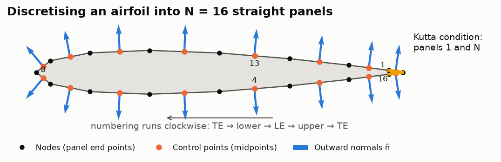
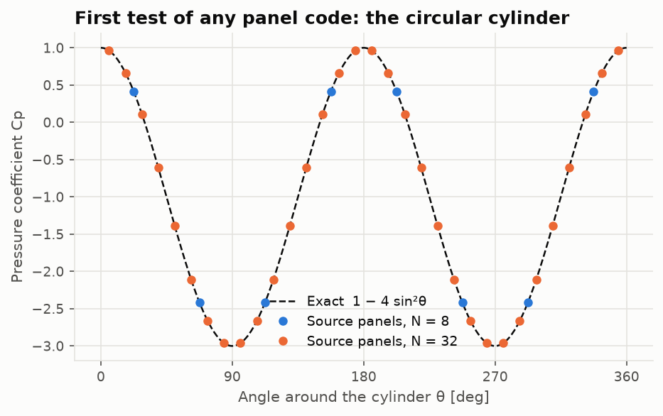

# Lesson 2 · The panel method

> Thin airfoil theory threw away thickness and put everything on the chord line. Now we put the
> singularities *on the real surface* and let a computer solve for them. This is the first true
> computational method in the course, and the ancestor of every panel code in industry.

**Code:** [`src/aero/panel_method_2d/hess_smith.py`](../../src/aero/panel_method_2d/hess_smith.py),
[`src/aero/singularities.py`](../../src/aero/singularities.py) ·
**Notebook:** [`02_panel_method.ipynb`](../../notebooks/02_panel_method.ipynb) ·
**Previous:** [Lesson 1](01-thin-airfoil-theory.md) · **Next:** [Lesson 3](03-boundary-layer.md)

## Learning objectives

1. Recall why potential flow lets us *superpose* elementary solutions.
2. Derive the velocity induced by a straight panel of constant source or vortex strength.
3. Set up the Hess–Smith linear system: $N$ tangency conditions plus the Kutta condition.
4. Recover $C_p$, $c_l$ and $c_m$ from the solution, and check them two independent ways.
5. Verify a panel code on the circular cylinder and an exact Joukowski airfoil.

---

## 1. Potential flow in one paragraph

For incompressible, inviscid, irrotational flow the velocity is the gradient of a potential,
$\mathbf V = \nabla\phi$, and mass conservation becomes **Laplace's equation**

$$
\nabla^2\phi = 0 .
$$

Laplace's equation is **linear**, so any sum of solutions is a solution. The whole panel method
rests on this: build the flow around a body by adding up simple flows whose strengths we choose.

The building blocks (2D, counter-clockwise circulation positive):

| Element | Potential | Velocity |
|---|---|---|
| Uniform stream | $V_\infty(x\cos\alpha + y\sin\alpha)$ | $V_\infty(\cos\alpha, \sin\alpha)$ |
| Source $\sigma$ | $\frac{\sigma}{2\pi}\ln r$ | $\frac{\sigma}{2\pi r}\,\hat{\mathbf e}_r$ |
| Vortex $\Gamma$ | $\frac{\Gamma}{2\pi}\theta$ | $\frac{\Gamma}{2\pi r}\,\hat{\mathbf e}_\theta$ |
| Doublet $\mu$ | $\frac{\mu}{2\pi}\frac{\cos\theta}{r}$ | source–sink pair in the limit |

A uniform stream plus a doublet of strength $\mu = 2\pi V_\infty R^2$ is the flow around a
circular cylinder of radius $R$. Add a vortex and the cylinder lifts, which is the Kutta–Joukowski
theorem in its simplest form. The tests in
[`test_singularities.py`](../../tests/test_singularities.py) check every one of these facts.

## 2. From points to panels

A real body needs a *distribution* of singularities along its surface. We approximate the surface
by $N$ straight **panels** and give each one a constant strength per unit length.



Conventions used in the code (and why):

- **Nodes run clockwise**, trailing edge → lower surface → leading edge → upper surface → trailing
  edge. Rotating each panel's tangent by +90° then gives a normal that points **into the fluid**.
- **Control points** are the panel midpoints. That is where the boundary condition is enforced.
- **Cosine spacing** (Lesson 1's Glauert spacing again) clusters panels at the leading and
  trailing edges, where the velocity changes fastest.

### 2.1 The velocity of one panel

Put a panel of length $L$ on the local $x$-axis from $0$ to $L$, with constant source density
$\sigma$. A field point $(x, y)$ sees each small piece $\sigma\,d\xi$ as a point source, so

$$
u = \frac{\sigma}{2\pi}\int_0^L \frac{x - \xi}{(x - \xi)^2 + y^2}\,d\xi,
\qquad
v = \frac{\sigma}{2\pi}\int_0^L \frac{y}{(x - \xi)^2 + y^2}\,d\xi .
$$

Both integrals are elementary:

$$
\boxed{\;u = \frac{\sigma}{2\pi}\ln\frac{r_1}{r_2},\qquad v = \frac{\sigma}{2\pi}\,\beta\;}
$$

where $r_1, r_2$ are the distances to the panel's end points and $\beta = \theta_2 - \theta_1$ is
the **angle the panel subtends** at the field point. A constant **vortex** panel gives the same
field rotated by 90°: $u = -\frac{\gamma}{2\pi}\beta$, $v = \frac{\gamma}{2\pi}\ln\frac{r_1}{r_2}$.

Two limits you must get right:

- **Far away**, $\beta \to L\,y/r^2$ and the panel looks like a point source of strength $\sigma L$.
- **On the panel itself**, approached from the fluid side, $\beta \to \pi$. The source panel then
  pushes fluid straight out with velocity $\sigma/2$, and the vortex panel slides it along at
  $-\gamma/2$. These **self-induced jumps** are half the story of the method.

> **Floating-point trap.** At a panel's own midpoint, $\beta$ is computed from `atan2` of a
> cross product that should be exactly zero. Rounding can make it $-10^{-17}$ instead of $+0$,
> which flips $\beta$ from $+\pi$ to $-\pi$. The code sets the diagonal to $\pi$ explicitly
> (`on_panel` mask in [`singularities.py`](../../src/aero/singularities.py)).

## 3. The Hess–Smith method

Hess and Smith (Douglas Aircraft, 1967) proposed the combination that is still the standard
teaching method:

- each panel $j$ has its **own source strength $\sigma_j$** (to represent thickness), and
- **one vortex strength $\gamma$ is shared by all panels** (to represent circulation, hence lift).

That is $N + 1$ unknowns. The equations:

**(i) Flow tangency at every control point** — no flow through the surface:

$$
\sum_{j=1}^{N} A^{n}_{ij}\,\sigma_j \;+\; \gamma\sum_{j=1}^{N} B^{n}_{ij} \;+\; \mathbf V_\infty\cdot\hat{\mathbf n}_i \;=\; 0,
\qquad i = 1\ldots N,
$$

where $A^n_{ij}$ is the normal velocity at control point $i$ due to a unit source on panel $j$,
and $B^n_{ij}$ the same for a unit vortex.

**(ii) The Kutta condition** — the flow leaves the trailing edge smoothly, so the tangential
speeds on the first and last panels (which meet at the trailing edge) are equal. Their tangents
point in opposite directions, so

$$
V_{t,1} + V_{t,N} = 0 .
$$

In matrix form this is a dense $(N+1)\times(N+1)$ system:

$$
\begin{bmatrix}
A^n & B^n\mathbf 1\\
(A^t_{1\cdot} + A^t_{N\cdot}) & \sum_j (B^t_{1j} + B^t_{Nj})
\end{bmatrix}
\begin{bmatrix}\boldsymbol\sigma\\ \gamma\end{bmatrix}
=
\begin{bmatrix}-\mathbf V_\infty\cdot\hat{\mathbf n}\\ -\mathbf V_\infty\cdot(\hat{\mathbf t}_1 + \hat{\mathbf t}_N)\end{bmatrix}
$$

`numpy.linalg.solve` does the rest. For 200 panels the whole solve, including building the matrices, takes about 10 ms.

## 4. Post-processing

With $\sigma_j$ and $\gamma$ known, the tangential velocity at each control point is

$$
V_{t,i} = \sum_j A^t_{ij}\sigma_j + \gamma\sum_j B^t_{ij} + \mathbf V_\infty\cdot\hat{\mathbf t}_i ,
\qquad
C_{p,i} = 1 - \left(\frac{V_{t,i}}{V_\infty}\right)^2 .
$$

Lift can be obtained **two independent ways**, and comparing them is a built-in check:

1. **Kutta–Joukowski:** $\Gamma = -\gamma\sum_j L_j$ (clockwise positive), $c_l = 2\Gamma/(V_\infty c)$.
2. **Pressure integration:** $\mathbf F = -\sum_j C_{p,j}\,\hat{\mathbf n}_j L_j$, rotated into lift and drag.

In exact potential flow the drag is zero (**d'Alembert's paradox**), so the pressure-integrated
drag measures discretisation error.

## 5. Verification: the cylinder, then an exact airfoil

**First test of any panel code:** a circular cylinder without circulation, where
$C_p = 1 - 4\sin^2\theta$ exactly.



Eight panels are already on the curve. In fact the control-point values are exact to round-off
for any $N$: on a regular polygon, constant source panels reproduce the cylinder solution at the
midpoints. So the cylinder catches sign and assembly bugs, but it **cannot measure
discretisation error** ([Lesson 6](06-verification-and-validation.md), exercise 1). For that we
need a harder exact case.

**The real test** needs a lifting airfoil with a known exact answer. The **Joukowski map**
$z = \zeta + b^2/\zeta$ turns a circle (whose flow we know) into a cambered, cusped airfoil
(whose flow we then also know). The Kutta condition at the cusp fixes
$\Gamma = 4\pi a V_\infty\sin(\alpha + \beta)$.


| Panels | $c_l$ panel | $c_l$ exact | error |
|---|---|---|---|
| 100 | 1.1677 | 1.2181 | −4.1 % |
| 200 | 1.1861 | 1.2181 | −2.6 % |
| 400 | 1.1988 | 1.2181 | −1.6 % |
| 800 | 1.2069 | 1.2181 | −0.9 % |

The error shrinks steadily, but more slowly than for a smooth airfoil (Lesson 6 measures the
order). A cusp is the worst case for constant-strength panels: the Kutta condition is applied
between two almost parallel panels.

## 6. Worked example: NACA 2412 at 6°

```python
import numpy as np
from aero.panel_method_2d import solve_airfoil

sol = solve_airfoil("2412", np.radians(6), n_panels=200)
sol.cl  # 0.9836  Kutta-Joukowski
sol.cl_pressure  # 0.9778  pressure integration (0.6 % apart)
sol.cd_pressure  # -2.8e-4  d'Alembert: ~0
sol.cm  # -0.0629  about c/4
```


Things to notice in the $C_p$ plot:

- **The suction peak** near the leading edge grows quickly with $\alpha$. Thin airfoil theory
  made it infinite; with thickness it is finite (−4 at 8°).
- **The trailing edge is a stagnation point** ($C_p \to +$) for a finite-angle trailing edge:
  both surfaces must decelerate to meet.
- **Camber lifts at zero incidence**: at $\alpha = 0$ the upper surface already has more suction
  than the lower one, and $c_l = 0.26$.


**Thickness changes the lift slope.** Thin theory says $2\pi$. The panel method gives
0.1209 per degree for NACA 0012, about 10 % more, close to the classical estimate
$2\pi(1 + 0.77\,t/c) = 0.1198$ per degree. **But the wind tunnel says 0.108.** The boundary layer
(Lesson 3) de-cambers the section and more than cancels the thickness effect. An inviscid method
*always* over-predicts lift slope and $|c_m|$; knowing the sign and size of that error is part of
using the tool well.

## 7. Common pitfalls

| Pitfall | Symptom | Fix |
|---|---|---|
| Counter-clockwise node order | normals point inward, nonsense $C_p$ | keep TE → lower → LE → upper order |
| Odd panel count | no node exactly at the LE | require even $N$ |
| Open trailing edge | Kutta panels don't meet | closed-TE thickness coefficient (−0.1036) |
| Self-influence by `atan2` | random sign flips on the diagonal | set $\beta = \pi$ on the diagonal |
| Trusting a single $c_l$ | hidden discretisation error | compare KJ vs pressure, refine $N$ |

## 8. Exercises

1. Show that a source panel seen from far away is a point source of strength $\sigma L$.
2. Why does the sum $\sum_j\sigma_j L_j$ have to be zero for a closed body? What does the code
   give, and how does it behave as $N$ doubles?
3. Solve NACA 0012 at 5° with $N = 20, 40, 80, \ldots$ and plot $c_l$. Estimate the converged value.
4. Replace the Kutta condition by $\gamma = 0$. What lift do you get, and why?

<details>
<summary>Answers</summary>

1. For $r \gg L$, $\ln(r_1/r_2) \to L\cos\theta/r$ and $\beta \to L\sin\theta/r$, exactly the point-source
   field with strength $\sigma L$.
2. A closed body must not create or destroy mass. The discrete solution satisfies it only to
   $O(1/N)$: $6.2\times10^{-4}$ at $N = 200$, halving each time $N$ doubles (tested).
3. About 0.6031 (Richardson extrapolation, Lesson 6).
4. Zero lift for any $\alpha$. Without circulation the flow wraps around the sharp trailing edge
   with infinite speed. The Kutta condition is the *only* thing that sets the lift.

</details>

## Key takeaways

- Laplace's equation is linear: put singularities on the surface and solve for their strengths.
- Hess–Smith: $N$ source strengths + one shared vortex; $N$ tangency conditions + Kutta.
- Verify on the cylinder, then on an exact lifting case; compare two independent lift estimates.
- Inviscid results over-predict lift slope and moment. The next lesson adds the boundary layer.

## Further reading

- Hess & Smith, "Calculation of potential flow about arbitrary bodies", *Prog. Aero. Sci.* 8, 1967.
- Katz & Plotkin, *Low-Speed Aerodynamics*, Chs. 10–11.
- Moran, *An Introduction to Theoretical and Computational Aerodynamics*, Ch. 4.
- Theory note in this repo: [panel_method_2d.md](../panel_method_2d.md).
