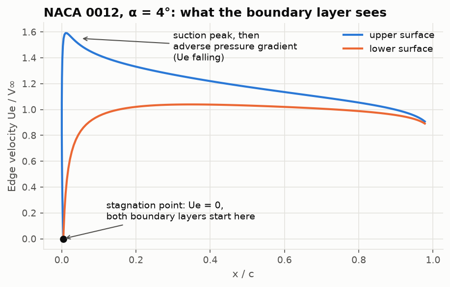
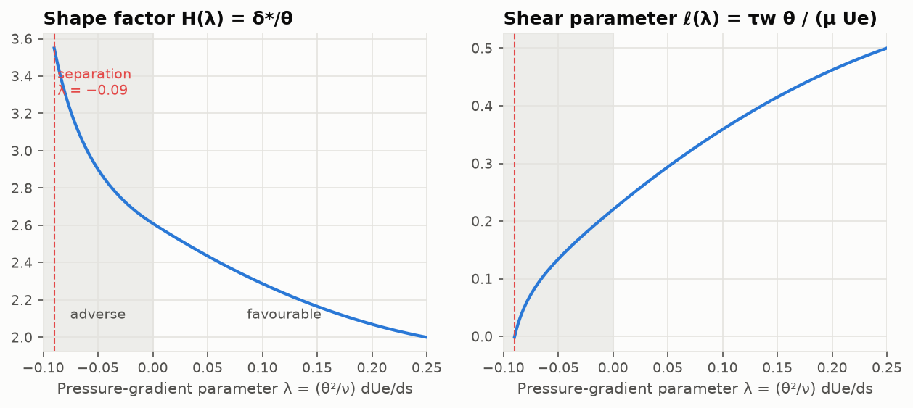
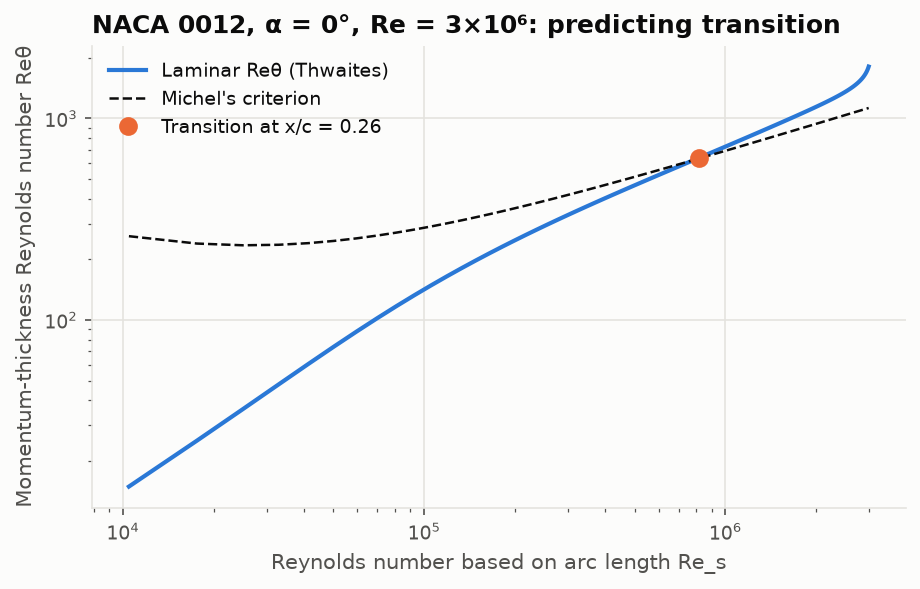
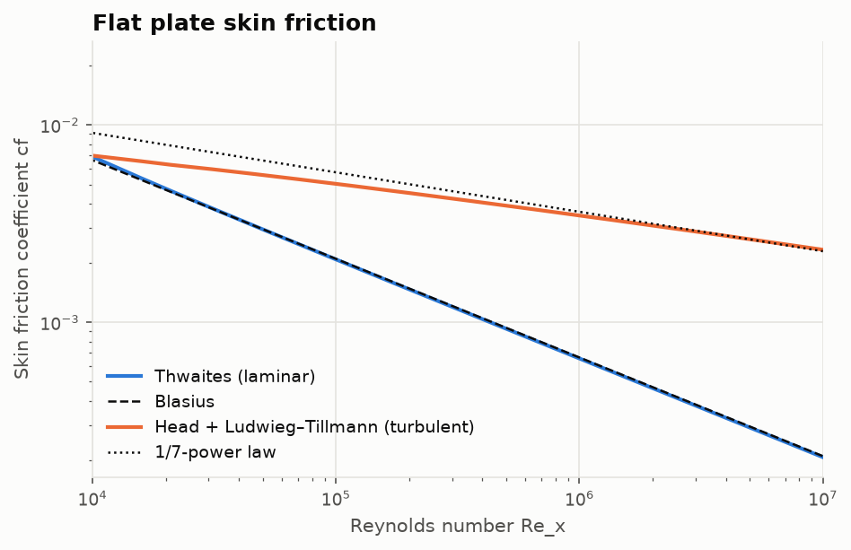
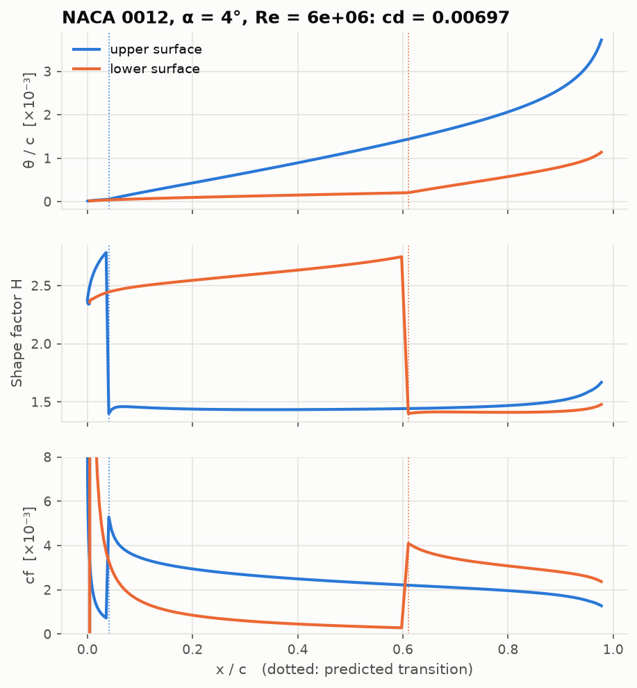
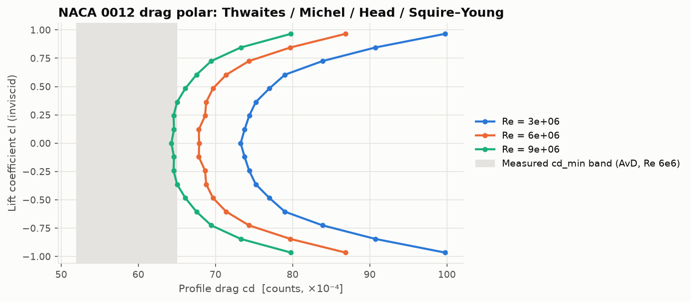

# Lesson 3 · The boundary layer and profile drag

> Potential flow predicts zero drag for every airfoil (d'Alembert's paradox). Real airfoils have
> drag because of a layer of air, often less than a millimetre thick, where viscosity matters.
> This lesson adds that layer on top of the panel method and gets a drag coefficient out of it.

**Code:** [`src/aero/boundary_layer/`](../../src/aero/boundary_layer) ·
**Notebook:** [`03_boundary_layer.ipynb`](../../notebooks/03_boundary_layer.ipynb) ·
**Previous:** [Lesson 2](02-panel-method.md) · **Next:** [Lesson 4](04-vortex-lattice-method.md)

## Learning objectives

1. Explain Prandtl's boundary-layer idea and define $\delta^*$, $\theta$ and $H$.
2. Derive the von Kármán momentum-integral equation and read the role of the pressure gradient.
3. Derive Thwaites' closed-form laminar solution and use it to predict laminar separation.
4. Predict transition with Michel's criterion and continue with Head's turbulent method.
5. Turn the trailing-edge state into a drag coefficient with the Squire–Young formula.

---

## 1. Prandtl's idea (1904)

At the wall the air must stick: **no-slip**, $u = 0$. Away from the wall, at high Reynolds
number, the flow behaves inviscidly. Prandtl's insight was that the transition between the two
happens in a **thin layer** whose thickness scales like

$$
\frac{\delta}{x} \sim \frac{1}{\sqrt{Re_x}} .
$$

At $Re = 3\times10^6$ that is a fraction of a percent of the chord. Two consequences shape the
whole method:

- The layer is thin, so **the pressure across it is constant** and equal to the value the
  inviscid solution (Lesson 2) gives at the edge. The panel method gives us $U_e(s)$ for free.
- We do not need the full velocity profile, only a few **integral thicknesses**.

## 2. Integral thicknesses

With $u(y)$ the velocity profile and $U_e$ the edge velocity:

| Quantity | Definition | Meaning |
|---|---|---|
| Displacement thickness | $\delta^* = \int_0^\infty\left(1 - \frac{u}{U_e}\right)dy$ | how far the outer flow is pushed away |
| Momentum thickness | $\theta = \int_0^\infty\frac{u}{U_e}\left(1 - \frac{u}{U_e}\right)dy$ | momentum lost to friction, **drag** |
| Shape factor | $H = \delta^*/\theta$ | profile "fullness": 2.59 laminar flat plate, ~1.4 turbulent, > 3.5 near laminar separation |

## 3. The momentum-integral equation

Integrating the boundary-layer momentum equation across the layer (von Kármán, 1921) gives one
ordinary differential equation along the surface coordinate $s$:

$$
\boxed{\;\frac{d\theta}{ds} + (2 + H)\,\frac{\theta}{U_e}\frac{dU_e}{ds} = \frac{c_f}{2}\;}
\qquad c_f = \frac{\tau_w}{\tfrac12\rho U_e^2}.
$$

Read it term by term:

- Wall friction $c_f/2$ **grows** $\theta$: momentum is being removed.
- A **favourable** gradient ($dU_e/ds > 0$, accelerating flow) thins the layer.
- An **adverse** gradient ($dU_e/ds < 0$) thickens it, and makes it thicken faster the larger $H$
  is. Push hard enough and the wall shear goes to zero: **separation**.

This is what the boundary layer sees on an airfoil:



Both boundary layers start at the **stagnation point** ($U_e = 0$), which at positive incidence
sits slightly on the lower surface. The upper-surface layer accelerates to the suction peak and
then spends the rest of the chord in an adverse gradient.

One equation, three unknowns ($\theta$, $H$, $c_f$). Every integral method is a different
**closure**: extra relations for $H$ and $c_f$.

## 4. Laminar flow: Thwaites' method

Define the **pressure-gradient parameter** and a shear parameter

$$
\lambda = \frac{\theta^2}{\nu}\frac{dU_e}{ds},
\qquad
\ell = \frac{\tau_w\,\theta}{\mu U_e}.
$$

Multiplying the momentum integral by $U_e\theta/\nu$ gives

$$
\frac{U_e}{\nu}\frac{d\theta^2}{ds} = 2\left[\ell - (2 + H)\lambda\right] \equiv F(\lambda).
$$

Thwaites looked at every exact laminar solution he could find and noticed that the right-hand
side is **almost a straight line**: $F(\lambda) \approx 0.45 - 6\lambda$. With that one
approximation,

$$
\frac{U_e}{\nu}\frac{d\theta^2}{ds} + \frac{6\theta^2}{\nu}\frac{dU_e}{ds} = 0.45
\;\;\Longrightarrow\;\;
\frac{d}{ds}\left(U_e^6\theta^2\right) = 0.45\,\nu\,U_e^5,
$$

which integrates in closed form:

$$
\boxed{\;\theta^2(s) = \frac{0.45\,\nu}{U_e^6(s)}\int_0^s U_e^5\,ds\;}
$$

Laminar boundary layers reduce to **one integral**. $H$ and $\ell$ then come from correlations in
$\lambda$, and laminar separation is predicted at $\lambda = -0.09$:



**Check on the flat plate** ($U_e$ = const): $\theta = \sqrt{0.45\,\nu x/U_e} = 0.671\,x/\sqrt{Re_x}$,
against Blasius' exact $0.664\,x/\sqrt{Re_x}$, about 1 % off.

**At the stagnation point**, $U_e \approx Ks$ and the formula gives the finite Hiemenz value
$\theta^2 = 0.075\,\nu/K$.

> **Numerical trap.** Near the stagnation point the integrand is $U_e^5 \propto s^5$. On the first
> interval the trapezoidal rule gives $K^5h^6/2$ while the exact integral is $K^5h^6/6$: **three
> times too large**, which spoils $\theta$ right where both boundary layers start. The code
> integrates $U_e^5$ exactly for piecewise-linear $U_e$,
> $\int_{s_1}^{s_2} U_e^5\,ds = \frac{h}{6}\sum_{k=0}^{5}u_1^k u_2^{5-k}$, and the Hiemenz test
> checks it.

## 5. Transition: Michel's criterion

A laminar layer eventually becomes unstable: small Tollmien–Schlichting waves grow and the flow
becomes turbulent. Predicting where is hard. XFOIL tracks wave amplification with the $e^N$
method. The simplest useful rule is **Michel's criterion** (1951): transition occurs where the
momentum-thickness Reynolds number reaches a critical curve

$$
Re_{\theta,tr} = 1.174\left(1 + \frac{22400}{Re_x}\right)Re_x^{0.46}.
$$



If the laminar layer separates first, the code assumes transition there: a laminar separation
bubble that reattaches turbulent. A `x_trip` argument forces transition at a chosen station,
like a trip strip in a wind tunnel.

## 6. Turbulent flow: Head's method

Turbulent layers are fuller ($H \approx 1.3$–$1.6$), rub harder on the wall and resist separation
better. Head's method (1958) closes the momentum integral with an **entrainment** equation: a
turbulent layer grows by swallowing outer fluid, at a rate that depends on its shape.

$$
\frac{d}{ds}\left(U_e\,\theta H_1\right) = U_e\,F(H_1),
\qquad F = 0.0306\,(H_1 - 3)^{-0.6169},
$$

with the mass-flow shape factor $H_1 = (\delta - \delta^*)/\theta$ related to $H$ by an empirical
fit. Skin friction comes from the **Ludwieg–Tillmann** law,

$$
c_f = 0.246\times10^{-0.678H}\,Re_\theta^{-0.268}.
$$

Two coupled ODEs ($\theta$ and $U_e\theta H_1$) are integrated with SciPy's `solve_ivp`, starting
from the laminar $\theta$ at transition with $H = 1.4$. Turbulent separation is flagged at
$H \gt 2.4$.



Thwaites lies on Blasius; Head reproduces the 1/7-power turbulent law within 2 % at
$Re_x = 10^7$. Notice turbulent friction is **several times higher** than laminar at the same
Reynolds number. That is why natural-laminar-flow airfoils work so hard to delay transition.

## 7. From the trailing edge to drag: Squire–Young

Drag equals the momentum deficit in the **far wake**, $c_d = 2\theta_\infty/c$. Squire and Young
(1937) integrated the momentum equation along the wake, where there is no wall friction, and
obtained a formula that only needs the trailing-edge state:

$$
\boxed{\;c_d = 2\,\theta_{TE}\left(\frac{U_{e,TE}}{V_\infty}\right)^{(H_{TE} + 5)/2}\;}
\qquad\text{(per surface, then summed).}
$$

It includes **both** skin friction and pressure (form) drag: the pressure part shows up as the
extra $\theta$ growth caused by the adverse gradient.

> **Trailing-edge trap.** For a finite-angle trailing edge, inviscid theory makes the TE a
> stagnation point: $U_e \to 0$ over the last few percent of chord. A real boundary layer never
> sees that, because its own displacement smooths the TE. The uncoupled method stops the march at
> $x/c = 0.98$. Results move by about 4 % between 0.95 and 0.995.

## 8. Worked example: NACA 0012, α = 0°, Re = 3×10⁶

```python
from aero.boundary_layer import viscous_drag
from aero.panel_method_2d import solve_airfoil

r = viscous_drag(solve_airfoil("0012", 0.0, 240), re=3e6)
r.upper.x_transition  # 0.26  (Michel)
r.upper.theta[-1], r.upper.H[-1], r.upper.ue[-1]  # 0.00257, 1.59, 0.902 at x/c = 0.98
r.cd, r.cd_friction  # 0.00733, 0.00647
```

By hand, per surface:

$$
c_d = 2 \times 0.00257 \times 0.902^{(1.59 + 5)/2} = 2 \times 0.00257 \times 0.712 = 0.00366,
$$

times two surfaces gives $c_d = 0.0073$, of which about 88 % is skin friction.



At α = 4° (figure above), the upper surface's suction peak and adverse gradient trigger
transition almost at the leading edge, while the lower surface stays laminar to 60 % chord. Note
how $H$ climbs towards separation values in the laminar regions and collapses to ~1.4 once the
flow is turbulent.



**How good is it?** Abbott & von Doenhoff measured about 0.0058 at Re = 6×10⁶; the method gives
0.0068, about 17 % high. The main culprit is transition: Michel puts it near 0.2c, earlier than
reality, so more of the surface pays the turbulent friction bill. The trends are right: drag
falls with Reynolds number and rises with incidence.

## 9. Common pitfalls

| Pitfall | Symptom | Fix |
|---|---|---|
| Trapezoids on $U_e^5$ at stagnation | $\theta$ 3× wrong at the start | exact piecewise-linear integral |
| Marching into the TE stagnation point | huge $\theta$ and $H$, drag blows up | stop at 0.98 c |
| Branch switch in correlations | tiny jumps in $H$ at $\lambda = 0$ | expected (fits differ by 1e-4); test with tolerance |
| Reading $c_d$ as exact | 10–20 % errors | transition model and no viscous–inviscid coupling |

## 10. Exercises

1. Derive Thwaites' flat-plate result $\theta = 0.671\,x/\sqrt{Re_x}$ and $c_f = 0.656/\sqrt{Re_x}$.
2. Show that for $U_e = Ks$ Thwaites' formula gives a constant $\theta$. Why does this make sense
   physically?
3. Howarth's retarded flow $U_e = 1 - x$: estimate the separation point with Thwaites by hand
   (hint: $\lambda(x)$ is available in closed form). Compare with the code and with 0.1199.
4. Force transition at 5 % chord (`x_trip=0.05`). How much does $c_d$ grow at Re = 3×10⁶? What
   does this tell you about the value of laminar flow?

<details>
<summary>Answers</summary>

1. $\theta^2 = 0.45\,\nu x/U_e$, so $\theta\sqrt{Re_x}/x = \sqrt{0.45} = 0.671$. With $\lambda = 0$,
   $\ell = 0.22$ and $c_f = 2\ell/Re_\theta = 0.44/(0.671\sqrt{Re_x}) = 0.656/\sqrt{Re_x}$.
2. $\theta^2 = \frac{0.45\nu}{K^6s^6}\cdot\frac{K^5s^6}{6} = \frac{0.075\,\nu}{K}$. Acceleration exactly
   balances viscous growth: the Hiemenz layer has constant thickness.
3. $\theta^2 = \frac{0.45\nu}{(1-x)^6}\cdot\frac{1 - (1-x)^6}{6}$ and $\lambda = -\theta^2/\nu$.
   Setting $\lambda = -0.09$ gives $(1-x)^{-6} = 2.2$, so $x \approx 0.123$ (code: 0.1232; exact 0.1199).
4. From 0.0073 to 0.0090, about +23 %. Keeping the forward quarter of the chord laminar is worth
   roughly 17 drag counts, which is the motivation for natural-laminar-flow sections.

</details>

## Key takeaways

- The boundary layer is thin, so the inviscid $U_e(s)$ drives it; integral methods need only $\theta$, $H$, $c_f$.
- Adverse pressure gradients thicken the layer and cause separation.
- Thwaites: laminar $\theta$ from a single integral. Michel: where transition happens. Head: the turbulent part.
- Squire–Young converts the trailing-edge state into total profile drag.
- Without viscous–inviscid coupling, expect 10–20 % errors and no stall. That is the next step toward XFOIL.

## Further reading

- White, *Viscous Fluid Flow*, 3rd ed., Chs. 4–6.
- Cebeci & Bradshaw, *Momentum Transfer in Boundary Layers*, 1977.
- Moran, *An Introduction to Theoretical and Computational Aerodynamics*, Ch. 7.
- Drela, "XFOIL: an analysis and design system for low Reynolds number airfoils", 1989.
- Theory note in this repo: [boundary_layer.md](../boundary_layer.md).
