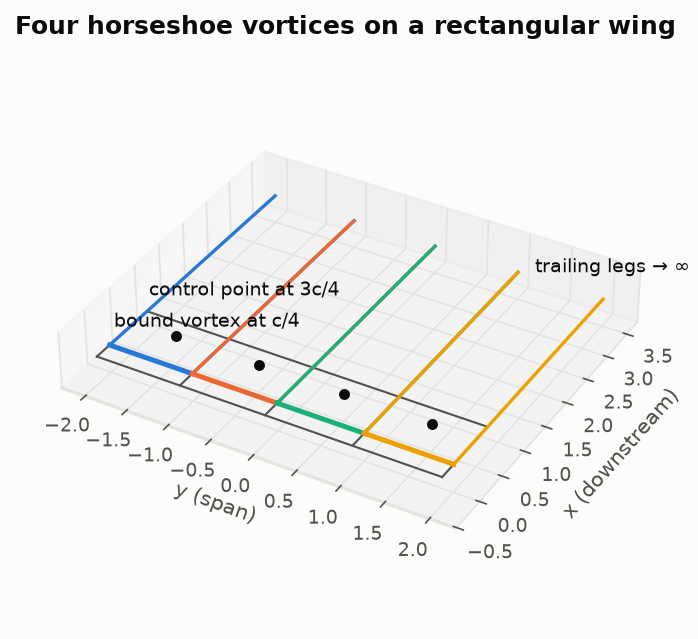
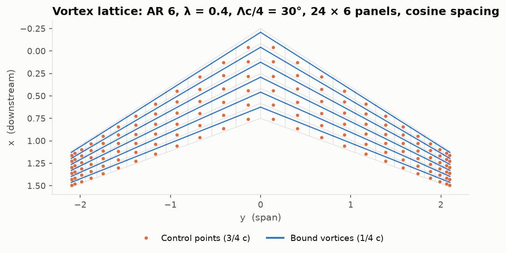
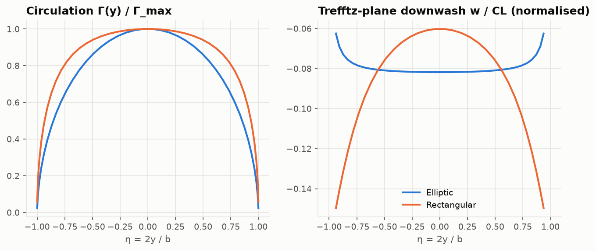

# Lesson 4 · Finite wings and the vortex lattice method

> A 2D airfoil is a wing of infinite span. Real wings end, and at the tips the high-pressure air
> underneath curls around to the low-pressure top. That leak creates trailing vortices, downwash
> and a new kind of drag that exists even in inviscid flow. This lesson builds the tool that
> computes it for any planform.

**Code:** [`src/aero/vortex_lattice_3d/`](../../src/aero/vortex_lattice_3d) ·
**Notebook:** [`04_vortex_lattice.ipynb`](../../notebooks/04_vortex_lattice.ipynb) ·
**Previous:** [Lesson 3](03-boundary-layer.md) · **Next:** [Lesson 5](05-planform-design.md)

## Learning objectives

1. Explain trailing vortices, downwash and induced drag with Helmholtz's vortex theorems.
2. State Prandtl's lifting-line results for the elliptic wing.
3. Use the Biot–Savart law to build horseshoe vortices, and justify the 1/4–3/4 rule.
4. Assemble and solve the vortex lattice system; compute lift, moment and Trefftz-plane induced drag.
5. Understand why *where* you put the spanwise control points changes the answer by several percent.

---

## 1. What changes in 3D

In 2D the bound vortex of Lesson 1 runs to infinity in both directions. On a finite wing it
cannot simply stop at the tips. **Helmholtz's second theorem** says a vortex filament cannot end
in the fluid: it must close on itself or extend to infinity. So the bound circulation **turns
the corner at the tips and trails downstream**.

More generally, wherever the spanwise circulation $\Gamma(y)$ changes, a trailing vortex of
strength $-d\Gamma/dy\,dy$ is shed. The trailing vortex sheet induces a downward velocity
**$w$ (downwash)** at the wing, which tilts the local flow by the **induced angle**

$$
\alpha_i(y) = -\frac{w(y)}{V_\infty}.
$$

Each section therefore sees a smaller effective angle $\alpha - \alpha_i$, so a finite wing lifts
less than its airfoil. The local lift vector is also tilted back by $\alpha_i$. Its streamwise
component is the **induced drag**:

$$
D_i = \int_{-b/2}^{b/2}\rho V_\infty\Gamma(y)\,\alpha_i(y)\,dy .
$$

This is the price of producing lift with a finite span. In cruise it is roughly a third to 40 %
of an airliner's drag, and in the climb after take-off it dominates.

## 2. Prandtl's lifting line in five lines

Replace the wing by a single bound vortex $\Gamma(y)$ on the quarter-chord line plus its
trailing sheet. The downwash of the sheet at the line is

$$
w(y_0) = -\frac{1}{4\pi}\int_{-b/2}^{b/2}\frac{d\Gamma/dy}{y_0 - y}\,dy .
$$

Requiring each section to behave like a 2D airfoil at its effective angle gives Prandtl's
**monoplane equation**. Its most famous solution:

> **Elliptic loading** $\Gamma = \Gamma_0\sqrt{1 - (2y/b)^2}$ produces a **constant downwash**
> $w = -\Gamma_0/(2b)$, and
> $$C_{D_i} = \frac{C_L^2}{\pi AR}, \qquad C_{L\alpha} = \frac{2\pi}{1 + 2/AR}.$$

For any other loading, $C_{D_i} = C_L^2/(\pi AR\,e)$ with span efficiency $e \le 1$, equal to 1
only for elliptic loading (Munk's theorem). Lesson 5 is about how close real planforms get.

The repository solves the monoplane equation with Glauert's Fourier method
([`lifting_line.py`](../../src/aero/vortex_lattice_3d/lifting_line.py)) as a reference. But
lifting line assumes every section is a 2D airfoil. That breaks down for low aspect ratio, for
sweep, and near the tips. We need a **lifting surface**.

## 3. The Biot–Savart law and the horseshoe vortex

A straight vortex segment from $A$ to $B$ with circulation $\Gamma$ induces at point $P$

$$
\mathbf V = \frac{\Gamma}{4\pi}\,\frac{\mathbf r_1\times\mathbf r_2}{|\mathbf r_1\times\mathbf r_2|^2}\;
\mathbf r_0\cdot\left(\frac{\mathbf r_1}{r_1} - \frac{\mathbf r_2}{r_2}\right),
\qquad \mathbf r_1 = P - A,\; \mathbf r_2 = P - B,\; \mathbf r_0 = B - A .
$$

A **horseshoe vortex** is three straight filaments: in from $+\infty$ to $A$, the bound segment
$A \to B$, and out from $B$ to $+\infty$. It satisfies Helmholtz automatically and is the
building block of the vortex lattice method.



> **Sign check before anything else.** Right-hand rule: thumb along the filament, fingers give the
> velocity. A filament along $+y$ induces $+x$ velocity above it ($\hat y\times\hat z = +\hat x$). Two
> of this repository's own first tests had that sign wrong; the *code* was right. Always derive the
> expected sign by hand before trusting a test.

## 4. The 1/4–3/4 rule

Where on each panel should the bound vortex go, and where should we enforce tangency? Test it on a
2D flat plate with **one** vortex $\Gamma$ at the quarter chord and **one** control point at the
three-quarter chord. The vortex induces at the control point, a distance $c/2$ away,

$$
w = \frac{\Gamma}{2\pi(c/2)} = \frac{\Gamma}{\pi c}.
$$

Tangency requires $w = V_\infty\alpha$, so $\Gamma = \pi c V_\infty\alpha$ and

$$
c_l = \frac{2\Gamma}{V_\infty c} = 2\pi\alpha .
$$

That is **exactly** thin-airfoil theory, with a single element. Every panel of the lattice uses
the same rule: bound vortex at its quarter chord, control point at its three-quarter chord.

## 5. The vortex lattice method

1. **Mesh** the planform into $n_{span}\times n_{chord}$ panels (chord law $c(\eta)$, sweep,
   dihedral). See the lattice figure below.
2. Put a **horseshoe** on each panel and a **control point** at 3/4 of its chord.
3. **Tangency** at every control point $i$:
   $$\sum_j \Gamma_j\,(\mathbf V_{ij}\cdot\hat{\mathbf n}_i) = -\mathbf V_\infty\cdot\hat{\mathbf n}_i ,$$
   where $\mathbf V_{ij}$ is the velocity at $i$ from a unit horseshoe $j$. This is a dense linear
   system, the **aerodynamic influence coefficient (AIC)** matrix.
4. **Forces** from Kutta–Joukowski on every bound segment, $\mathbf F_j = \rho\,\Gamma_j\,\mathbf V_\infty\times\mathbf l_j$.



**Twist goes into the normals, not the geometry.** Linear VLM keeps the lattice flat and rotates
each control-point normal by the local twist $\varepsilon$:
$\hat{\mathbf n} = \hat{\mathbf n}_{flat}\cos\varepsilon + \hat{\mathbf x}\sin\varepsilon$. A first
version of this code built the twist into the panel corners instead. The panels warped, the
control points rose off the plane of the trailing legs, and washout *increased* the tip load. That
is a textbook example of a small modelling choice creating a large spurious result.

## 6. Induced drag in the Trefftz plane

Integrating forces on the wing (near field) is sensitive to how the lattice is drawn. Far
downstream, in the **Trefftz plane**, the wake is a set of parallel vortex lines and the problem
becomes 2D. The strength shed at spanwise node $k$ is the jump in strip circulation,
$\Delta\Gamma_k = \Gamma_{k-1} - \Gamma_k$. The induced drag is the kinetic energy left in that
cross-flow:

$$
D_i = -\frac{\rho}{2}\sum_j \Gamma_j\,(\mathbf w_j\cdot\hat{\mathbf n}_j)\,\Delta s_j ,
$$

with $\mathbf w_j$ the velocity of the 2D point-vortex row at strip $j$. (The Trefftz downwash is
twice the downwash at the wing, which is where the $\tfrac12$ comes from.)



The figure shows Prandtl's result numerically. The elliptic wing's downwash is **flat across the
span**; the rectangular wing's grows toward the tips, where its loading falls off too abruptly.
(Near the tips the discrete wash of the elliptic wing curls up slightly, a discretisation effect.)

## 7. Why the spanwise spacing matters: a debugging story

The first version of this VLM gave $e = 1.03$ for an elliptic wing. That is impossible, since
nothing beats elliptic loading. Refining the mesh brought it down only slowly, like $1/N$.

The diagnosis was to separate the solver from the drag evaluation. Feeding an **exactly elliptic**
$\Gamma$ into the Trefftz routine alone still gave $e = 1.03$ with 40 strips. So the fault was in
where the wash was evaluated. The fix comes from the same trigonometry as Lesson 1: with nodes at
$y_k = -\frac b2\cos\phi_k$ (uniform $\phi$), place the control points at the
**$\phi$-midpoints**, not the $y$-midpoints. The discrete Trefftz drag of elliptic loading is then
**exact to round-off**, and the whole lattice converges at second order
([Lesson 6](06-verification-and-validation.md)).


## 8. Validation and a worked example

```python
import numpy as np
from aero.vortex_lattice_3d import Wing, solve_vlm

s = solve_vlm(Wing.elliptic(8), np.radians(5), n_span=40, n_chord=6)
s.CL  # 0.4174
s.CDi  # 0.006938
s.CL**2 / (np.pi * 8)  # 0.006933  -> e = 0.9992
```

Lifting line would predict $C_L = \frac{2\pi}{1 + 2/8}\times 0.0873 = 0.439$. The VLM gives
**5 % less**. At AR 8 the chord is not negligible compared with the span, and lifting-surface
theory always sits below lifting line. The gap closes as AR grows:


| Benchmark | VLM | Reference |
|---|---|---|
| Elliptic wing, AR 4 / 8 / 20: $e$ | 0.998 / 0.999 / 1.000 | 1 (Prandtl) |
| Circular wing ($AR = 4/\pi$): $C_{L\alpha}$ | 1.781 | 1.790 (Kinner, exact lifting surface) |
| AR 5, λ 0.5, 45° sweep: $C_{L\alpha}$ | 3.415 | 3.44 (Bertin & Smith) |
| AR 100 elliptic: $C_{L\alpha}$ | within 0.5 % | lifting line |

## 9. Common pitfalls

| Pitfall | Symptom | Fix |
|---|---|---|
| Wrong right-hand-rule sign | negative lift, or tests that "fail" on correct code | derive signs by hand |
| Control point on a trailing leg | division by zero / huge velocity | cut-off core in Biot–Savart |
| Twist built into the geometry | spurious tip loads | twist through the normals |
| Uniform spacing / $y$-midpoints | $e \gt 1$ for elliptic wings, $O(1/N)$ convergence | cosine spacing, $\phi$-midpoints |
| Near-field induced drag | mesh-sensitive $C_{D_i}$ | Trefftz plane |

## 10. Exercises

1. Show that a semi-infinite vortex induces, at its foot, exactly half the velocity of an
   infinite one.
2. Prove that elliptic loading gives constant downwash (use $y = -\frac b2\cos\theta$).
3. Run a rectangular AR 8 wing with `spacing="uniform"` and `"cosine"` for 10–100 spanwise
   panels. Plot $e$ against $N$ and explain the difference.
4. Add 4° of linear washout to a rectangular wing. What happens to $C_L$, to $e$ and to the
   section $c_l$ near the tip? Why do designers accept the $e$ penalty?

<details>
<summary>Answers</summary>

1. Semi-infinite: $\frac{\Gamma}{4\pi h}(1 + \cos 90°) = \frac{\Gamma}{4\pi h}$, half of $\frac{\Gamma}{2\pi h}$.
2. $\Gamma = \Gamma_0\sin\theta$ gives $d\Gamma/dy \propto \cos\theta/\sin\theta$, and Glauert's integral
   (Lesson 1) returns a constant.
3. Uniform spacing over-predicts $e$ and converges like $1/N$; cosine spacing with $\phi$-midpoints
   converges in about 20 panels.
4. $C_L$ drops and the section $c_l/C_L$ near the tip falls (0.45 → 0.26 at α = 5°), so the tips
   stall **later** and the ailerons keep working near stall. With twist, $e$ depends on $C_L$: at
   α = 5° ($C_L$ = 0.26) it drops from 0.972 to 0.946, while at α = 10° ($C_L$ = 0.65) it rises to
   0.998, because washout unloads the overloaded rectangular tips. Twist is optimal at only one
   lift coefficient, so designers pick it for cruise and for safe stall behaviour.

</details>

## Key takeaways

- Finite span → trailing vortices → downwash → induced drag, even in inviscid flow.
- Elliptic loading: constant downwash, $C_{D_i} = C_L^2/(\pi AR)$, the minimum possible.
- VLM = horseshoe vortices at 1/4 chord, tangency at 3/4 chord, one linear solve.
- Compute induced drag in the Trefftz plane; use cosine spacing with $\phi$-midpoint control points.
- Lifting-surface $C_{L\alpha}$ lies below lifting line; the gap is largest at low AR.

## Further reading

- Katz & Plotkin, *Low-Speed Aerodynamics*, Chs. 8 and 12.
- Anderson, *Fundamentals of Aerodynamics*, Ch. 5.
- Bertin & Smith, *Aerodynamics for Engineers*, Ch. 7.
- Lan, "A quasi-vortex-lattice method in thin wing theory", *J. Aircraft* 11(9), 1974.
- Theory note in this repo: [vortex_lattice_3d.md](../vortex_lattice_3d.md).
