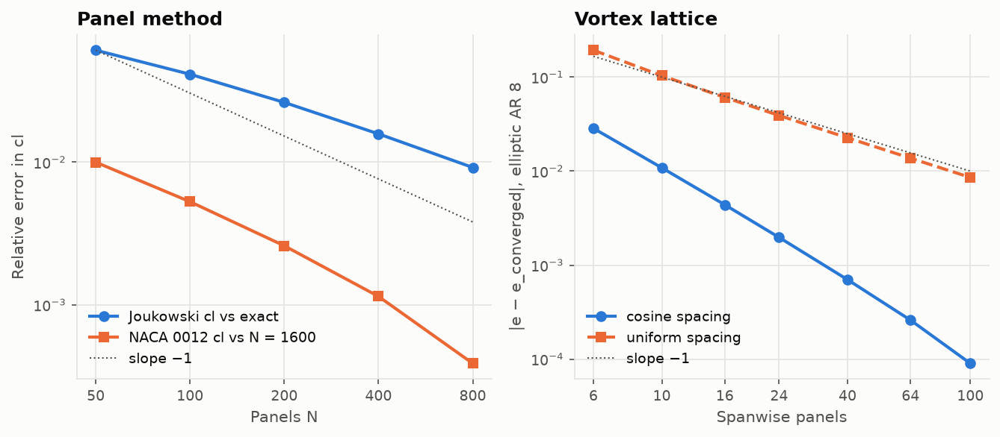

# Lesson 6 · Verification and validation: how do you know it's right?

> Every previous lesson ended with a table of "computed vs reference". This lesson is about the
> discipline behind those tables. A solver that produces plausible-looking plots is easy to
> write; a solver you can *trust* is the actual deliverable.

**Code:** [`tests/`](../../tests), [`validation/`](../../validation),
[`.github/workflows/ci.yml`](../../.github/workflows/ci.yml) ·
**Report:** [validation-report.md](../validation-report.md) ·
**Previous:** [Lesson 5](05-planform-design.md) · **Back to:** [course index](README.md)

## Learning objectives

1. Distinguish **verification** from **validation**, and say which one each test performs.
2. Build a hierarchy of tests from kernels up to wind-tunnel data.
3. Measure the **observed order of accuracy** and use **Richardson extrapolation**.
4. Handle reference data honestly, and write tests that assert the *expected* disagreement.
5. Recognise the bugs these practices caught in this project, and why each was otherwise invisible.

---

## 1. Two different questions

| | Verification | Validation |
|---|---|---|
| Question | *Are we solving the equations right?* | *Are we solving the right equations?* |
| Compared against | exact mathematical solutions, convergence | experiment |
| A failure means | a bug or a discretisation error | a modelling limitation |
| Example here | panel method vs exact Joukowski solution | panel method vs NACA 2412 wind-tunnel data |

The order matters. **Verify first, then validate.** If the code does not solve its own equations
correctly, agreement with experiment is a coincidence, and disagreement tells you nothing about
the physics.

## 2. The test hierarchy used in this project

```
                ┌──────────────────────────────┐
                │  validation vs experiment    │  NACA 0012/2412 data, cd_min
                ├──────────────────────────────┤
                │  physical trends             │  drag falls with Re, sweep loads tips
                ├──────────────────────────────┤
                │  consistency checks          │  KJ vs pressure lift, Trefftz vs Fourier
                ├──────────────────────────────┤
                │  convergence studies         │  error vs N, observed order
                ├──────────────────────────────┤
                │  exact solutions             │  cylinder, Joukowski, Blasius, elliptic wing
                ├──────────────────────────────┤
                │  kernel unit tests           │  one panel, one vortex segment vs quadrature
                └──────────────────────────────┘
```

Each level assumes the one below it works. Some concrete examples:

- **Kernels:** the panel velocity formulas are checked against `scipy.integrate.quad` of point
  singularities at random field points, and the Biot–Savart segment against numerical
  integration of the line integral. If these fail, nothing above can be trusted.
- **Exact solutions:** every method has at least one:

  | Method | Exact solution |
  |---|---|
  | Thin airfoil | parabolic arc: $\alpha_{L0} = -2h$, $c_{m,c/4} = -\pi h$ |
  | Panel method | cylinder $C_p = 1 - 4\sin^2\theta$; Joukowski airfoil |
  | Boundary layer | Blasius; Hiemenz stagnation flow; Howarth separation |
  | VLM | elliptic wing $e = 1$; Kinner's circular wing |

- **Consistency:** two independent routes to the same quantity. Lift from Kutta–Joukowski vs
  from pressure integration (agree to 0.5 %). Drag from pressure integration, which d'Alembert
  says must be zero (so its size measures discretisation error). Induced drag from the Trefftz
  plane vs from a Fourier fit of $\Gamma(y)$ (agree to $10^{-4}$).

## 3. Order of accuracy

For a consistent discretisation the error behaves like

$$
\varepsilon(N) \approx C\,N^{-p},
$$

where $p$ is the **order of accuracy**. Doubling $N$ divides the error by $2^p$. From three
solutions on grids $N$, $2N$, $4N$ you can measure the **observed order** without knowing the exact
answer:

$$
p_{obs} = \log_2\frac{f_{2N} - f_N}{f_{4N} - f_{2N}} .
$$

And once you know $p$, **Richardson extrapolation** estimates the converged value:

$$
f_\infty \approx f_{2N} + \frac{f_{2N} - f_N}{2^p - 1}.
$$



What the measurements show:

| Case | Observed order | Comment |
|---|---|---|
| NACA 0012 $c_l$, panel method | 0.89 → 0.94 | approaching the expected first order |
| Joukowski $c_l$, panel method | 0.66 → 0.73 → 0.78 | **below** first order: the cusped trailing edge |
| Elliptic wing $e$, VLM, uniform spacing | ≈ 1 | first order |
| Elliptic wing $e$, VLM, cosine + $\phi$-midpoints | ≈ 2 | second order |

**Worked Richardson example.** NACA 0012 at 5°: $c_l = 0.604818$ ($N = 200$) and $0.603944$
($N = 400$). With $p = 1$:

$$
c_{l,\infty} \approx 0.603944 + \frac{0.603944 - 0.604818}{2 - 1} = 0.603070 ,
$$

matching the $N = 800$ trend ($0.603488$ and still falling by about half the previous step).

> **An honesty note.** Earlier versions of this repository's docs called the Joukowski convergence
> "first order". Measuring it for this lesson showed about 0.7–0.8. The docs were corrected. A
> claimed convergence order is a *measurement*, and it should be measured, not assumed.

## 4. Validation data, handled honestly

Rules this project follows (see [`validation/reference_data/`](../../validation/reference_data)):

1. **Every number carries its source** in the file itself.
2. **Use published summary values, not invented curves.** If you cannot cite a data point, do not
   plot it as experiment.
3. **Use bands, not single numbers.** Measurements scatter with Reynolds number, model finish and
   reading accuracy.
4. **Never tune a model to match.** If the solver disagrees, explain why or fix the physics.
5. **Test the expected disagreement.** An inviscid method *should* over-predict lift slope. The
   test asserts $1.0 \lt c_{l\alpha,panel}/c_{l\alpha,measured} \lt 1.2$. That is stronger than a loose
   "close enough" tolerance: if a future change made the panel method agree perfectly with
   experiment, the test would fail, correctly, because that agreement would be unphysical.

## 5. Bugs this discipline caught

Every item below produced output that *looked* reasonable. Only a specific test exposed it.

| Symptom | Caught by | Root cause | Lesson |
|---|---|---|---|
| Elliptic wing $e = 1.03$ | exact solution ($e \le 1$) + convergence study | Trefftz wash evaluated at $y$-midpoints | [4](04-vortex-lattice-method.md) |
| Washout *raised* the tip load | physical-trend test | twist built into the panel geometry | [4](04-vortex-lattice-method.md) |
| $\theta$ 3× too large at the stagnation point | Hiemenz exact solution | trapezoids on $U_e^5 \propto s^5$ | [3](03-boundary-layer.md) |
| Biot–Savart tests failing | deriving the sign by hand | the *tests* had the wrong right-hand-rule sign | [4](04-vortex-lattice-method.md) |
| Spike at the Joukowski trailing edge | looking at the plot | exact solution is $0/0$ at the cusp | [2](02-panel-method.md) |
| CI red after a "passing" local run | CI on every push | a shell pipe (`… \| tail`) hid ruff's exit code | this lesson |
| "First-order" convergence in the docs | measuring $p_{obs}$ | an assumption written down as a fact | this lesson |

Two process lessons are hidden in that table. **Tests can be wrong too**: when a test fails,
check the test's expectation as carefully as the code. **Automate the gate**: CI caught a
formatting failure that the local check had silently swallowed.

## 6. Reproducibility

- `uv run python validation/run_all.py` regenerates **every figure and table** in the report.
  Running it twice produces byte-identical files, which `git status` confirms.
- Notebooks are generated from [`notebooks/build_notebooks.py`](../../notebooks/build_notebooks.py),
  so their source is reviewable in diffs.
- CI runs lint and the full test suite on Python 3.11 and 3.12 on every push.
- Dependencies are pinned in `uv.lock`.

## 7. A checklist for your own solver

- [ ] Unit-test each kernel against numerical quadrature or a closed form.
- [ ] Find at least one exact solution of the *full* problem and test against it.
- [ ] Run a convergence study, measure the observed order, and compare it with theory.
- [ ] Compute one quantity two independent ways.
- [ ] Only then compare with experiment, with cited data and an explained gap.
- [ ] Assert the *direction* of known modelling errors, not just a tolerance.
- [ ] Make every figure regenerable from a script, and run the tests in CI.

## 8. Exercises

1. Measure the observed order of the cylinder $C_p$ error for $N = 16, 32, 64, 128$. What order do
   you expect for a smooth body?
2. Apply Richardson extrapolation to the VLM $C_L$ of a rectangular AR 8 wing with cosine spacing
   ($N = 10, 20, 40$). How many panels do you actually need for 0.1 % accuracy?
3. Write a test that would have caught the washout bug without knowing the correct answer
   (hint: what must happen to the tip section's $c_l$ when you add washout?).
4. The NACA 0012 drag comes out 17 % high. List two *verification* tests and one *validation*
   experiment you would run to find out whether the error is in the code or in the model.

<details>
<summary>Answers</summary>

1. Surprise: the error is at round-off level ($\sim10^{-15}$) for **every** $N$, so no order can be
   measured. For a regular polygon, constant-strength source panels give the exact cylinder $C_p$ at
   the panel midpoints. The cylinder is a *necessary* test (it catches sign and assembly bugs) but
   not a *sufficient* one: it cannot reveal discretisation error. That is why the Joukowski airfoil
   is needed.
2. $C_L$ = 0.399242, 0.399518, 0.399550 for $N$ = 10, 20, 40: the changes are 0.069 % and 0.008 %.
   Ten spanwise panels are already within 0.1 %, and the observed order is about 3. Integrated
   lift converges faster than span efficiency.
3. Assert that every outboard strip's $c_l$ decreases when washout is added (this is now
   `test_washout_unloads_the_tips`).
4. Verification: the flat-plate turbulent drag against a known skin-friction law, and a transition
   location forced with `x_trip` against the free-transition result. Validation: compare
   free-transition drag against data at several Reynolds numbers, or tripped drag against
   tripped-model data; if tripped cases agree and free ones don't, the transition model is the
   culprit.

</details>

## Key takeaways

- Verification (math) comes before validation (physics).
- Test at every level: kernels, exact solutions, convergence, consistency, trends, experiment.
- Measure the order of accuracy; use Richardson to estimate the converged answer.
- Cite reference data, use bands, and assert the expected sign of modelling errors.
- Plausible output is not evidence. The bugs in this project all looked plausible.

## Further reading

- Roache, *Verification and Validation in Computational Science and Engineering*, Hermosa, 1998.
- Oberkampf & Roy, *Verification and Validation in Scientific Computing*, Cambridge, 2010.
- AIAA G-077-1998, *Guide for the Verification and Validation of Computational Fluid Dynamics Simulations*.
- This repository's [validation report](../validation-report.md).
