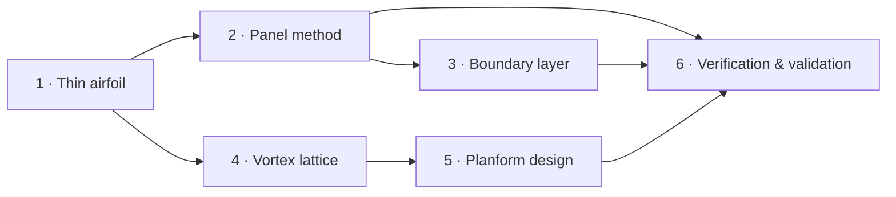

# Aerodynamics from scratch: the course

Six lessons that build a working aerodynamics toolkit from first principles. Each lesson
derives the theory, turns it into the code in this repository, checks it against exact or
published results, and ends with exercises (answers included).


## Lessons

| # | Lesson | You will learn | Key result |
|---|---|---|---|
| 1 | [Thin airfoil theory](01-thin-airfoil-theory.md) | vortex sheets, the Kutta condition, Glauert's Fourier solution | $c_l = 2\pi(\alpha - \alpha_{L0})$, c/4 is the aerodynamic centre |
| 2 | [The panel method](02-panel-method.md) | superposition, panel integrals, the Hess–Smith system | pressure distributions on real airfoils; Joukowski exact to 0.9 % |
| 3 | [Boundary layer and profile drag](03-boundary-layer.md) | momentum integral, Thwaites, Michel, Head, Squire–Young | a drag polar from an inviscid solution |
| 4 | [Finite wings and the VLM](04-vortex-lattice-method.md) | downwash, induced drag, Biot–Savart, Trefftz plane | elliptic wing $e = 1.000$ |
| 5 | [Planform design](05-planform-design.md) | taper, aspect ratio, sweep, stall behaviour | $D_i = L^2/(q\pi b^2 e)$; optimum taper ≈ 0.4 |
| 6 | [Verification and validation](06-verification-and-validation.md) | test hierarchies, order of accuracy, honest validation | the bugs this project caught, and how |



Lessons 1 → 2 → 3 follow the 2D airfoil path; 1 → 4 → 5 follow the 3D wing path. Lesson 6 ties
them together and can be read at any point.

## Prerequisites

- Calculus and vector calculus (line integrals, cross products).
- Basic fluid mechanics: Bernoulli, the idea of a streamline and of viscosity.
- Linear algebra: solving $A\mathbf x = \mathbf b$.
- Enough Python/NumPy to read a 50-line function.

## How to use it

1. **Read the lesson.** Every formula is derived; skip derivations on a first pass if you like.
2. **Run the matching notebook** in [`notebooks/`](../../notebooks) and change the inputs.
3. **Open the code** linked at the top of each lesson. It is short and mirrors the equations.
4. **Do the exercises** before opening the answers.

```bash
uv sync
uv run --with jupyterlab jupyter lab notebooks/
```

JupyterLab is not a project dependency; `--with` pulls it in for that command only.

## Figures

The teaching figures in [`docs/figures/lessons/`](../figures/lessons) are generated by
[`make_figures.py`](make_figures.py):

```bash
uv run python docs/lessons/make_figures.py
```

## Reference texts

- J. D. Anderson, *Fundamentals of Aerodynamics*. The main companion for Lessons 1, 4 and 5.
- J. Katz & A. Plotkin, *Low-Speed Aerodynamics*. Panel methods and the VLM in depth.
- F. M. White, *Viscous Fluid Flow*. Boundary layers.
- I. H. Abbott & A. E. von Doenhoff, *Theory of Wing Sections*. Airfoil data.
