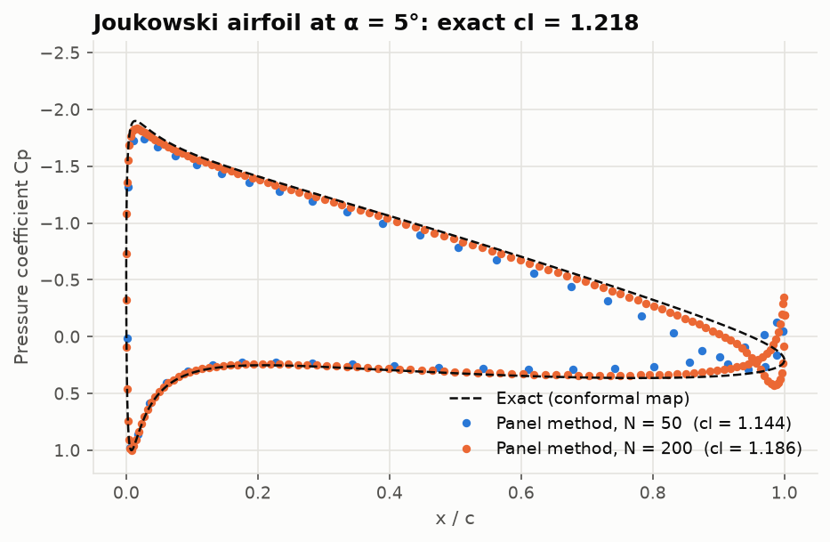
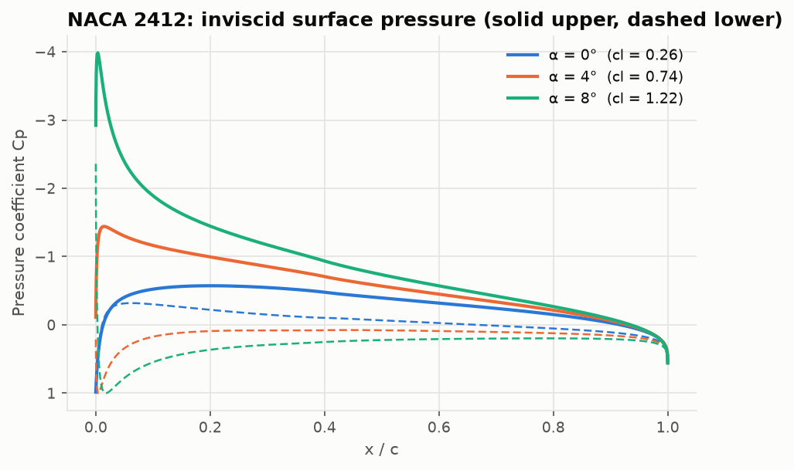
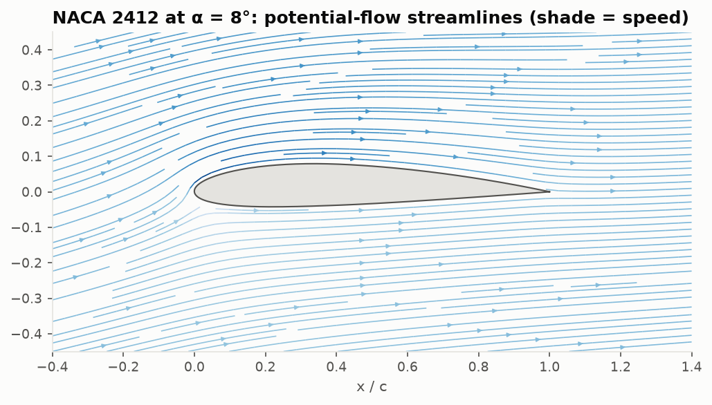
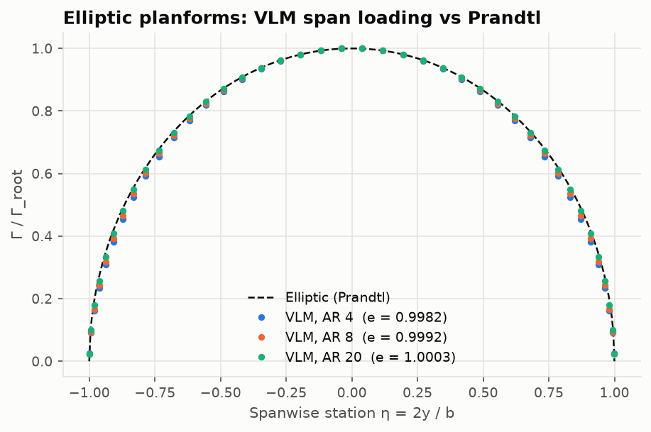
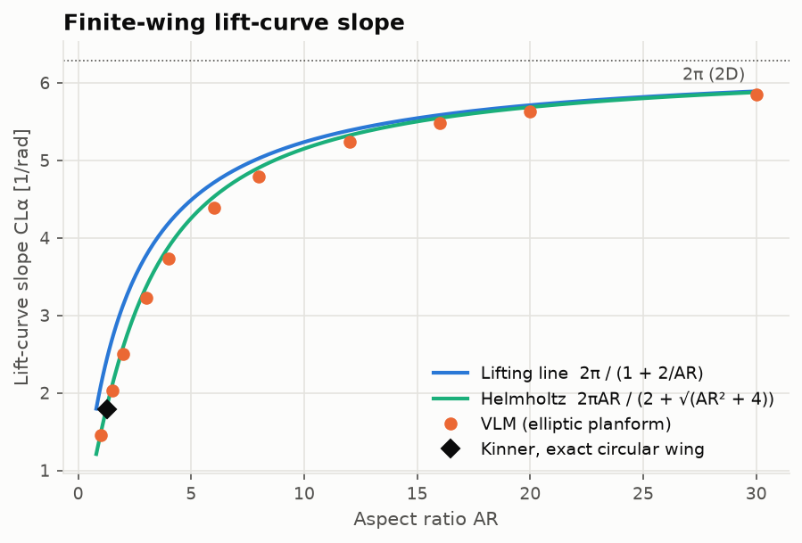
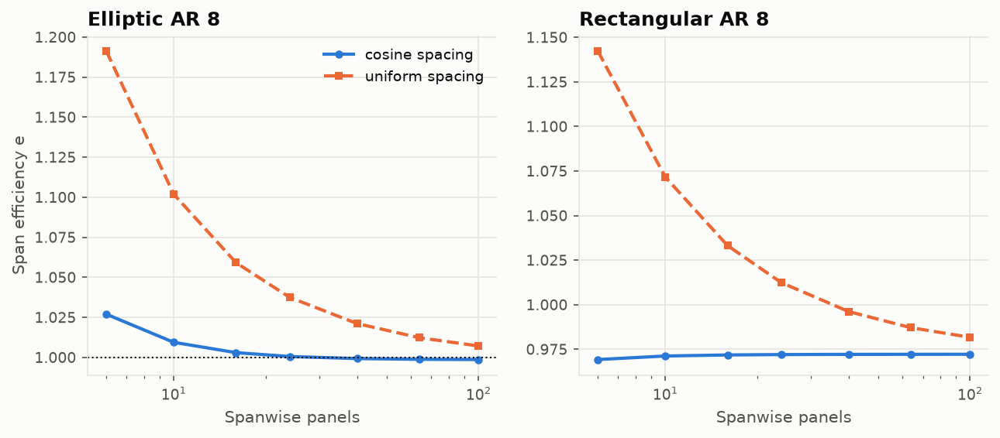
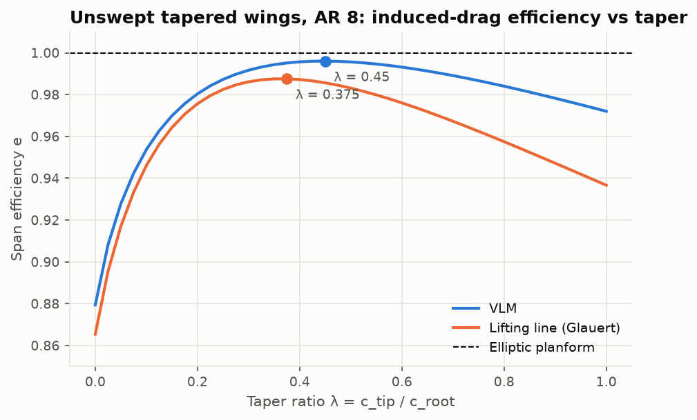
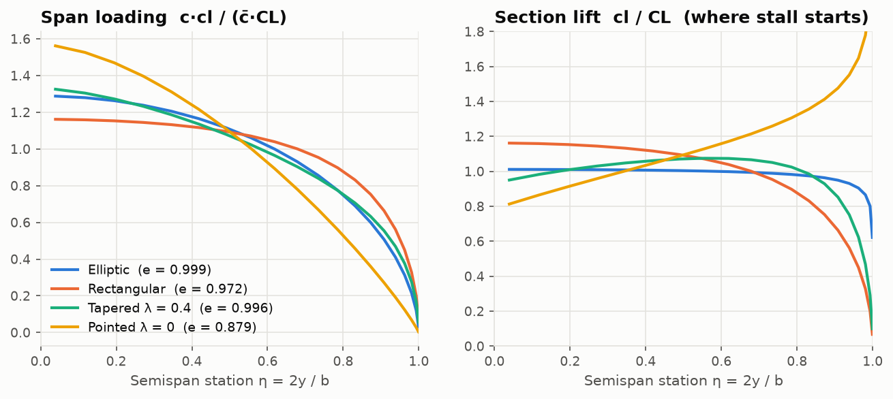
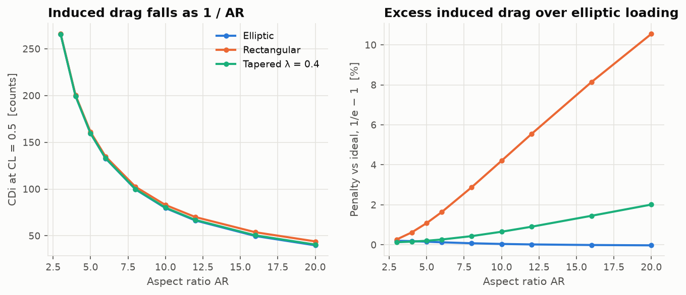
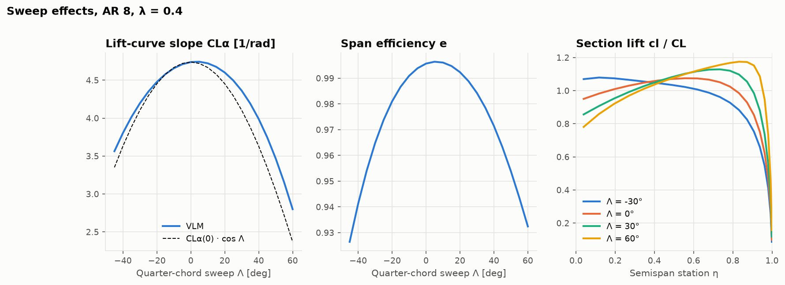

# Validation report

Every solver in this repository is checked against a closed-form result, an exact solution,
or a cited published value. All numbers below are produced by the scripts in
[`validation/`](../validation) (`uv run python validation/run_all.py`), which also write the
figures in [`docs/figures/`](figures) and the raw tables in
[`validation/results/`](../validation/results). The same checks run as `pytest` on every push.

Reference data lives in [`validation/reference_data/`](../validation/reference_data) with the
source cited on every row. They are published summary values, not digitised curves; the bands
used in the checks reflect reading and Reynolds-number spread.

## Scorecard

| Solver | Benchmark | Computed | Reference | Status |
|---|---|---|---|---|
| Thin airfoil | NACA 2412 $\alpha_{L0}$ / $c_{m,c/4}$ | −2.077° / −0.0531 | −2.077° / −0.053 (Anderson) | exact |
| Panel method | Circular cylinder $C_p$ | exact to round-off | $1 - 4\sin^2\theta$ | ✔ |
| Panel method | Joukowski airfoil $c_l$ (N = 800) | 1.2069 | 1.2181 (exact) | −0.9 % |
| Panel method | NACA 2412 $\alpha_{L0}$ | −2.15° | −2.1° (measured) | ✔ |
| Boundary layer | Blasius $\theta\sqrt{Re_x}/x$ | 0.671 | 0.664 | +1.0 % |
| Boundary layer | Howarth separation | 0.1232 | 0.1199 | +2.8 % |
| Boundary layer | NACA 0012 $c_d$, Re 6e6 | 0.0068 | ≈ 0.0058 (measured) | +17 % |
| VLM | Elliptic wing $e$ (AR 4–20) | 0.998–1.000 | 1 | ✔ |
| VLM | Circular wing $C_{L\alpha}$ | 1.781 | 1.790 (Kinner) | −0.5 % |
| VLM | Swept tapered wing $C_{L\alpha}$ | 3.415 | 3.44 (Bertin & Smith) | −0.8 % |
| Planform | Optimum taper, AR 8 | λ = 0.45 (VLM), 0.375 (LL) | ≈ 0.35–0.4 (classical LL) | ✔ |

## 1. Thin airfoil theory

Glauert coefficients by adaptive quadrature reproduce the parabolic-arc closed form
($A_1 = 4h$, $\alpha_{L0} = -2h$, $c_{m,c/4} = -\pi h$) to round-off and Anderson's worked
NACA 2412 example to all quoted digits. Against measurements, thin-airfoil theory predicts
$\alpha_{L0}$ well (−2.08° vs −2.1°) and over-predicts the nose-down moment (−0.053 vs −0.045).

## 2. Panel method

**Exact solutions.** The non-lifting circular cylinder matches $C_p = 1 - 4\sin^2\theta$ to
round-off at the control points for any panel count. On a regular polygon the discrete solution
is exact there, so this test catches sign and assembly errors but not discretisation error. The
Joukowski airfoil has an exact conformal-map solution. The panel method converges to it with an
observed order of 0.66 → 0.78, below first order, because the cusped trailing edge is the
hardest case for constant-strength panels:

| N | $c_l$ panel | $c_l$ exact | error |
|---|---|---|---|
| 100 | 1.1677 | 1.2181 | −4.14 % |
| 200 | 1.1861 | 1.2181 | −2.62 % |
| 400 | 1.1988 | 1.2181 | −1.58 % |
| 800 | 1.2069 | 1.2181 | −0.92 % |

**NACA sections vs measurements** (Re ≈ 6e6, Abbott & von Doenhoff):

| Airfoil | Quantity | Thin airfoil | Panel (N = 300) | Measured |
|---|---|---|---|---|
| NACA 0012 | $c_{l\alpha}$ [/deg] | 0.1097 | 0.1209 | 0.108 |
| NACA 2412 | $\alpha_{L0}$ | −2.08° | −2.15° | −2.1° |
| NACA 2412 | $c_{l\alpha}$ [/deg] | 0.1097 | 0.1207 | 0.105 |
| NACA 2412 | $c_{m,c/4}$ | −0.0531 | −0.0604 | −0.045 |

The panel method includes thickness, so its lift slope is ~10 % above $2\pi$ — close to the
classical $2\pi(1 + 0.77\ t/c)$. Real sections fall *below* $2\pi$ because the boundary layer
thickens towards the trailing edge on the suction side and effectively de-cambers the section;
the same effect reduces $|c_m|$. The inviscid over-prediction of 12–15 % in lift slope and
0.015 in $c_m$ is therefore the expected gap, and the tests assert its sign and bound.

## 3. Boundary layer and profile drag

| Case | Computed | Reference |
|---|---|---|
| Flat plate, laminar $\theta\sqrt{Re_x}/x$ | 0.6708 | 0.664 (Blasius) |
| Howarth $U_e = 1 - x$, laminar separation | 0.1232 | 0.1199 (exact) |
| NACA 0012, $\alpha = 0$, Re 3e6 | $c_d$ = 0.00733, transition 0.26c | — |
| NACA 0012, $\alpha = 0$, Re 6e6 | $c_d$ = 0.00679, transition 0.20c | ≈ 0.0058 |
| NACA 0012, $\alpha = 0$, Re 9e6 | $c_d$ = 0.00643, transition 0.18c | — |

Thwaites' method is within its known 1 % of Blasius and 3 % of Howarth's exact separation
point; Head's method reproduces the turbulent 1/7-power flat plate within 10 %. The complete
airfoil chain over-predicts NACA 0012 minimum drag by about 15 %: Michel's criterion triggers
transition around 0.2c, so a larger fraction of the surface is turbulent than in the
experiment. The trends — drag falling with Reynolds number, rising with incidence, transition
moving forward on the suction side — are correct. Close to 90 % of the drag is skin friction at
low incidence.

## 4. Vortex lattice method

| Case | VLM | Reference |
|---|---|---|
| Elliptic AR 4: $e$ / $C_{L\alpha}$ | 0.9981 / 3.730 | 1 / 3.883 (Helmholtz), 4.189 (LL) |
| Elliptic AR 8: $e$ / $C_{L\alpha}$ | 0.9992 / 4.786 | 1 / 4.906 (Helmholtz), 5.027 (LL) |
| Elliptic AR 20: $e$ / $C_{L\alpha}$ | 1.0003 / 5.636 | 1 / 5.686 (Helmholtz), 5.712 (LL) |
| Circular wing $C_{L\alpha}$ | 1.781 | 1.790 (Kinner, exact lifting surface) |
| AR 5, λ 0.5, Λ 45° $C_{L\alpha}$ (4 vortices per semispan) | 3.415 | 3.44 (Bertin & Smith) |

The elliptic planform gives an elliptic span loading and $C_{D_i} = C_L^2/(\pi AR)$ to 0.2 %,
reproducing Prandtl's result. Lift slopes lie below lifting-line theory, as lifting-surface
theory must at finite aspect ratio, and converge to it as AR grows (within 0.5 % at AR 100).
The exact circular-wing solution is matched within 0.5 %.

The spanwise discretisation matters: with cosine spacing and control points at the $\phi$
mid-points, $e$ converges in ~24 panels; uniform spacing over-predicts $e$ by 2 % even with 40.

## 5. Planform trade studies

- **Elliptic loading is optimal.** No planform beats $e = 1$; the pointed ($\lambda = 0$) wing
  is worst ($e = 0.88$ at AR 8) because it over-loads the tips.
- **Taper.** Span efficiency peaks at $\lambda = 0.45$ in the VLM ($e = 0.996$) and
  $\lambda = 0.375$ in lifting line ($e = 0.988$), the classical ~0.35–0.4 optimum.
- **Aspect ratio.** $C_{D_i}$ at fixed $C_L$ falls as $1/AR$; the penalty of a rectangular wing
  over elliptic loading grows from 0.3 % at AR 3 to 10.5 % at AR 20.
- **Sweep.** $C_{L\alpha}$ drops roughly like $\cos\Lambda$; aft sweep shifts load outboard
  (section $c_l/C_L$ near the tip rises from 0.85 to 1.07 between 0° and 45°) — the tip-stall
  tendency of swept wings — and forward sweep shifts it inboard.

## Known discrepancies and their causes

| Discrepancy | Cause | Fix (out of scope) |
|---|---|---|
| Inviscid $c_{l\alpha}$ 12–15 % above experiment | no boundary-layer displacement | viscous–inviscid coupling |
| NACA 0012 $c_d$ ~15 % high | early Michel transition, uncoupled BL | $e^N$ transition, coupled solver |
| Joukowski convergence below first order (0.66 → 0.78) | cusped TE with constant-strength panels | linear-vorticity panels |
| Rectangular-wing $e$: VLM 0.972 vs LL 0.937 (AR 8) | lifting-line strip assumption at a square tip | — (model difference) |

## References

- Abbott, I. H. & von Doenhoff, A. E., *Theory of Wing Sections*, Dover, 1959.
- Anderson, J. D., *Fundamentals of Aerodynamics*, McGraw-Hill.
- Bertin, J. J. & Smith, M. L., *Aerodynamics for Engineers*, Prentice Hall.
- Cebeci, T. & Bradshaw, P., *Momentum Transfer in Boundary Layers*, Hemisphere, 1977.
- Hess, J. L. & Smith, A. M. O., "Calculation of potential flow about arbitrary bodies",
  *Progress in Aerospace Sciences* 8, 1967.
- Katz, J. & Plotkin, A., *Low-Speed Aerodynamics*, 2nd ed., Cambridge University Press, 2001.
- Kinner, W., "Die kreisförmige Tragfläche auf potentialtheoretischer Grundlage",
  *Ingenieur-Archiv* 8, 1937.
- Lan, C. E., "A quasi-vortex-lattice method in thin wing theory", *J. Aircraft* 11(9), 1974.
- Moran, J., *An Introduction to Theoretical and Computational Aerodynamics*, Wiley, 1984.
- White, F. M., *Viscous Fluid Flow*, 3rd ed., McGraw-Hill, 2006.
